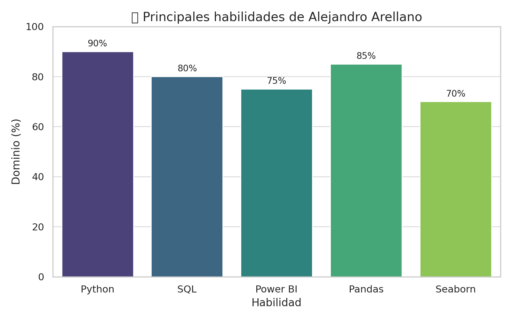

<h1 align="center">¡Hola! 👋 este es Alejandro Arellano</h1>
<h2>Soy..</h2>

[](https://git.io/typing-svg)

---

```python
import pandas as pd
import numpy as np
import matplotlib.pyplot as plt
import seaborn as sns

# Cargando los datos de mi perfil
df = pd.read_csv('Alejandro_Arellano.csv')

# Exploración inicial
print("👨‍💻 Explorando mi perfil profesional...")
print(df.head(5))
```

👨‍💻 Explorando mi perfil profesional...
| 📊 Columna | 📌 Descripción |
| ----------- | ----------- |
| Name | Alejandro Arellano  |
| Role | Data Analyst & BI|
| Focus | Python, SQL, Power BI, Ciencia de datos|
| Learning | Platzi: ML, Visualizacion de datos|
| Location | México, CDMX|

```python
# Visualización de habilidades
skills = ['Python', 'SQL', 'Power BI', 'Pandas', 'Seaborn']
usage = [90,80,75,85,70]

plt.figure(figsize=(8, 4))
sns.barplot(x=skills, y=usage, palette='viridis')
plt.title('🔧 Principales habilidades de Alejandro Arellano')
plt.ylabel('Dominio (%)')
plt.xlabel('Habilidad')
plt.show()
```



---

## Tech Stack


 


## 🚀 About Me

- 👨‍💻 Apasionado por el análisis de datos y la tecnología.

- 📚 Actualmente estudiando Ciencia de Datos y Business Intelligence.

- 📈 Me encanta convertir datos en decisiones útiles y visuales claras.

- 📊 En constante aprendizaje: DuckDB, ML, Cálculo integral, Git y más.

- 🧠 Explorando temas como Machine Learning, DuckDB y cálculo integral.

- 👨‍👩‍👧 Papá orgulloso de una niña increíble llamada Emily 💜

- :racing_car: Fan de la Fórmula 1 (F1) y del rendimiento de alta velocidad. 🏁

---

### 📈 GitHub Stats


---

### 📬 ¿Hablamos?

[](https://www.linkedin.com/in/alejandro-arellano-camacho/)
[](mailto:luis.alex.2711@gmail.com)